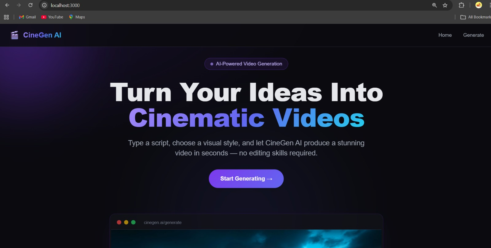
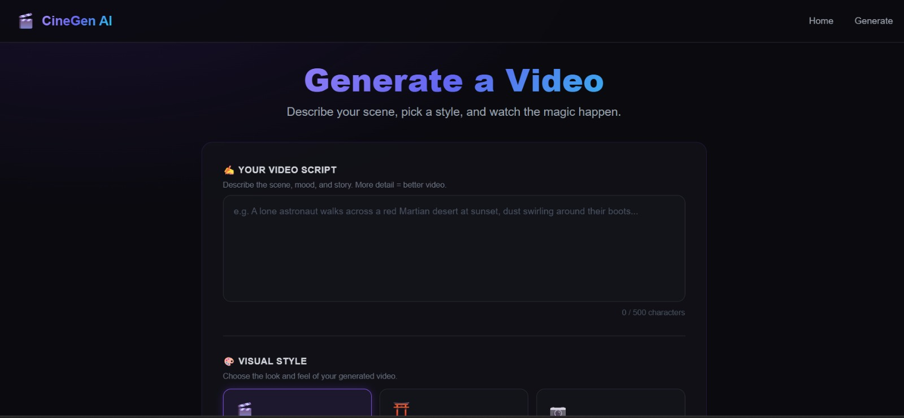
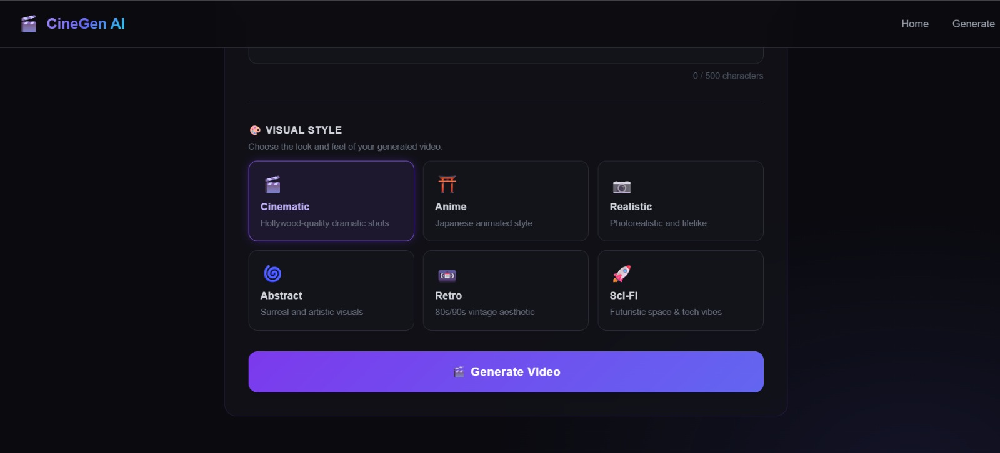

# 🎬 CineGen AI – AI Cinematic Video Generator

## 📸 Project Preview

### Video Generation Interface


### Script Input


### Style Selection


---

An **AI-Powered Video Generation App** built to transform simple text scripts into fully synchronized, cinematic video slideshows. 
This project focuses on **complex AI orchestration**, including **LLM prompt engineering**, **diffusion image generation**, and **programmatic video editing**.

---

## 🚀 Features

### ✅ Level 1 – Core Architecture & UI
- Clean, responsive glassmorphism interface with Next.js 14 & Tailwind CSS
- Powerful FastAPI Python backend to handle heavy AI processing
- Dynamic style selection (Cinematic, Anime, Realistic, Retro, etc.)
- Real-time video preview and downloadable MP4 output

### ✅ Level 2 – AI Orchestration (The "Scene Director")
- **One-Shot LLM Pipeline**: Powered by the **Groq API** (`llama-3.1-8b-instant`)
- Takes a raw script and intelligently splits it into 5–7 narrative scenes.
- Automatically generates two perfectly synced outputs per scene:
  - A highly detailed *Visual Prompt* for image generation.
  - A concise *Subtitle* for on-screen text and voiceover.

### ✅ Level 3 – Media Generation & Cinematic Stitching 
- **AI Image Generation**: Powered by **Hugging Face** (`FLUX.1-schnell`) to generate gorgeous 1280x720 HD frames per scene.
- **Dynamic Voiceover**: Converts subtitles into natural Text-to-Speech narration using **gTTS**.
- **Cinematic Video Assembly**: Uses **MoviePy** to automatically stitch the video with:
  - **Ken Burns Effect**: Slow, continuous zooms on every frame.
  - **Crossfades**: Smooth 0.5s transitions linking scenes.
  - **Perfect Syncing**: Mathematically syncs image durations so the final video exactly matches the generated audio length.
  - **Subtitles**: Native Pillow-rendered subtitles pinned to the bottom.

---

## 🧠 Key Design Decisions
- **Decoupled Architecture**: Separating the Next.js frontend from the FastAPI backend ensures the heavy Python video-rendering load doesn't block the UI.
- **Fallback Mechanisms**: Pillow placeholder images keep the pipeline running if external AI APIs rate-limit or fail.
- **Robust Event Handling**: Safe, asynchronous endpoint fetching decoupled with custom React styling and states.

---

## 📂 Project Structure

```text
cinegen-ai/
│
├── frontend/                 # Next.js UI
│   ├── app/
│   │   ├── generate/         # Main Generation View
│   │   ├── globals.css       # Custom styles
│   │   ├── layout.js         
│   │   └── page.js           # Landing Page
│   │
│   ├── components/           # Reusable React UI 
│   │   ├── GenerateButton.jsx
│   │   ├── HeroSection.jsx
│   │   ├── Loader.jsx      
│   │   ├── Navbar.jsx      
│   │   ├── ScriptInput.jsx 
│   │   ├── StyleSelector.jsx 
│   │   └── VideoPreview.jsx  
│   │
│   └── utils/                
│       └── api.js            # FastAPI Connection
│
├── backend/                  # FastAPI & AI Logic
│   ├── routes/               
│   │   └── generate.py       # Main API Endpoint
│   │
│   ├── services/             # Core AI Modules
│   │   ├── image_generator.py # Hugging Face Image API
│   │   ├── llm_enhancer.py    # Legacy Prompt Enhancer
│   │   ├── scene_director.py  # Groq LLM Orchestration
│   │   ├── scene_splitter.py  # Legacy Scene Splitter
│   │   ├── video_creator.py   # MoviePy Rendering Pipeline
│   │   └── voice_generator.py # gTTS Audio Generation
│   │
│   ├── utils/                
│   │   └── file_manager.py    # Disk I/O handlers
│   │
│   ├── outputs/              # Final rendered media destination
│   ├── main.py               # Uvicorn Server Entry Point
│   ├── requirements.txt      # Python Dependencies
│   └── .env                  # Secure AI API Keys
│
└── README.md                 # Project documentation
```

---

## 🛠️ Technologies Used

- **Frontend**: Next.js 14, React, Tailwind CSS
- **Backend Framework**: FastAPI, Uvicorn, Pydantic
- **AI / LLM**: Groq API (`llama-3.1-8b-instant`), HuggingFace API (`FLUX.1-schnell`)
- **Media Processing**: MoviePy, Pillow (PIL), gTTS (Google Text-to-Speech)
- **API Requests**: `httpx`, `fetch`

---

## 🧪 How to Run the Project

1. **Clone the repository**
   ```bash
   git clone <repository-url>
   cd cinegen-ai
   ```

2. **Backend Setup (.env & Python)**
   Create a `.env` file in the `backend/` folder and add your API keys:
   ```env
   GROQ_API_KEY=your_groq_api_key_here
   HUGGINGFACE_API_KEY=your_huggingface_token_here
   ```
   Install dependencies and start the server:
   ```bash
   cd backend
   pip install -r requirements.txt
   python -m uvicorn main:app --reload --port 8000
   ```

3. **Frontend Setup (Node.js)**
   Open a new terminal, navigate to the frontend, and start the development server:
   ```bash
   cd frontend
   npm install
   npm run dev
   ```
   The frontend will start at `http://localhost:3000`.

---

